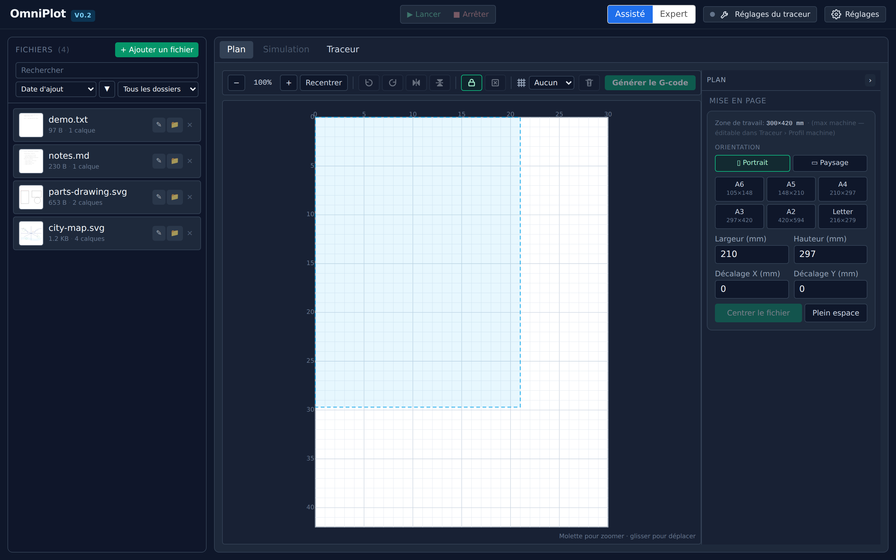
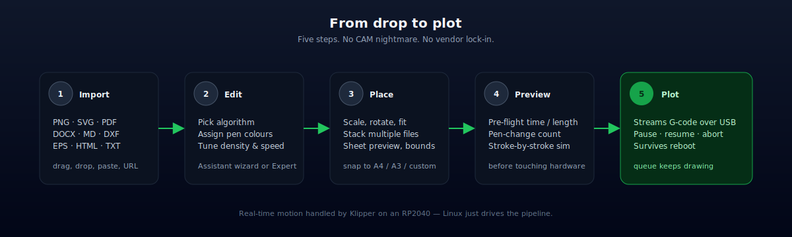
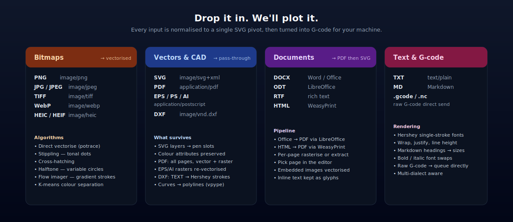
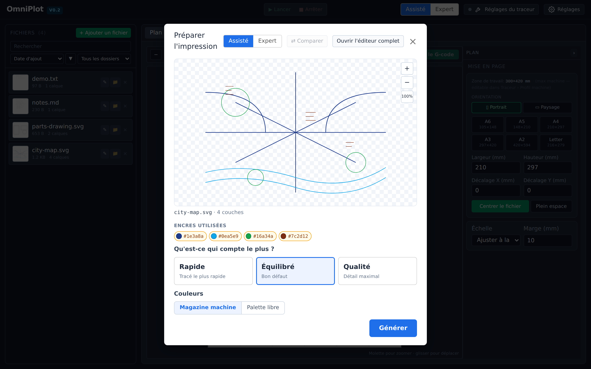
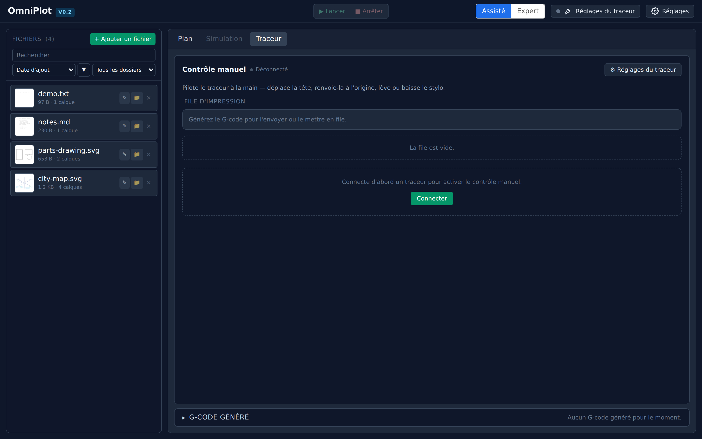

# OmniPlot

> **Universal pen plotter studio.** Drag a file in, plot it on any pen plotter
> — bitmap, vector, document or raw G-code, one interface.


<p align="center">
  
</p>

---

## What it is

A self-hosted web app for a **Raspberry Pi + pen plotter** combo. Open it in
any browser on your LAN, drop a file, watch it draw.

- **One workflow for every input** — photos, SVGs, PDFs, Word docs, Markdown,
  CAD drawings, even raw G-code.
- **One UI for every plotter** — AxiDraw, iDraw, EBB-based, or a DIY CoreXY
  on Klipper. New machines via a YAML profile, no code.
- **Two skill levels** — *Assistant* wizard for quick prints, *Expert* editor
  for per-layer control.
- **Plot survives reboots.** The queue checkpoints; a power blip resumes
  from the last stroke, not from the start.

<p align="center">
  
</p>

---

## Install on a Raspberry Pi

Fresh Raspberry Pi OS / Ubuntu / Debian. One command, ~3 minutes:

```bash
bash <(curl -fsSL https://raw.githubusercontent.com/glloq/rsp-pen-plotter/main/bootstrap.sh) --service
```

Then open `http://<pi-ip>:8000` from any device on your network. That's it.

What the installer does: apt packages (`potrace`, `ghostscript`,
`libreoffice-writer`), Node.js 20, the `uv` Python toolchain, builds the
frontend, and (with `--service`) enables a `systemd` unit that auto-starts on
boot and adds the user to the `dialout` group for USB serial access.

Drop `--service` to install without the systemd unit and launch manually
with `./start.sh`. Full install / config reference:
[`docs/getting_started.md`](docs/getting_started.md).

---

## Supported file types

<p align="center">
  
</p>

| Category | Extensions | Notes |
| --- | --- | --- |
| **Bitmaps** | `.png` `.jpg` `.jpeg` `.tiff` `.webp` `.heic` `.heif` | Vectorised via potrace, stippling, hatching, halftone, flow imager. K-means colour separation. |
| **Vectors** | `.svg` | Pass-through. Layers map to pen slots, attributes (`stroke`, `fill`) preserved. |
| **CAD / print** | `.pdf` `.dxf` `.eps` `.ps` `.ai` | Per-page PDF selection. DXF `TEXT`/`MTEXT` rendered with Hershey single-stroke fonts. Embedded rasters re-vectorised inline. |
| **Documents** | `.docx` `.odt` `.rtf` `.html` | Office docs via headless LibreOffice → PDF; HTML via WeasyPrint. |
| **Text** | `.txt` `.md` | Hershey fonts; Markdown headings become font sizes. |
| **Raw G-code** | `.gcode` `.nc` | Direct send / queue, no transformation. |

If your plotter has a documented G-code dialect, it's supported — write a
YAML profile, no code changes needed. See
[`docs/profile_format.md`](docs/profile_format.md).

---

## The editor

Two surfaces share the same model — flip between them at any time from the
*Assisté / Expert* toggle in the header.

<p align="center">
  
</p>

- **Assistant** (above): a wizard that asks what matters — *fast*,
  *balanced* or *quality* — then picks the algorithm, density and colour
  separation for you. Newcomers ship their first plot without reading docs.
- **Expert**: rich per-layer panel — algorithm per layer, simplification
  tolerance, pen-up/pen-down speeds, pen-slot assignment, multi-pass
  stacks, and the optimisation toggle.
- **Compare drawer**: render two variants side-by-side with metrics
  (length, time, swaps) before committing.
- **Live preview**: every tweak re-renders the placed SVG against the sheet,
  with a stroke-by-stroke simulator one tab away.

---

## Pre-flight & operate

<p align="center">
  
</p>

Catch problems before the pen touches paper:

- bounds check (out-of-workspace warning)
- effective scale and physical dimensions in mm
- estimated drawing + travel time
- pen-change count, with one-click reordering to minimise swaps
- missing pen-slot detection (generation blocks if a layer points to an
  empty magazine slot)

While printing:

- pause / resume / abort from the UI or a hardware button
- guided pen-change pauses (software-driven, downloaded G-code stays
  portable — the `M0` survives)
- per-slot calibration (servo depth per pen)
- audit log of every sensitive action (connect, run, home, abort)
- optional `OMNIPLOT_API_KEY` for LAN deployments

---

## Architecture, in one diagram

```
 ┌──────────────────────────────────────────────┐
 │ 1. Vue 3 UI            (browser)             │ ─┐
 │ 2. FastAPI orchestrator (Python, on the Pi)  │  │
 │ 3. Graphics + toolpath  (vpype)              │  │  Raspberry Pi
 │ 4. Persistent queue     (SQLite)             │ ─┘
 │ 5. Real-time motion     (Klipper)            │ ─── RP2040 MCU
 │ 6. Drivers + mechanics  (TMC2209 · CoreXY)   │ ─── Hardware
 └──────────────────────────────────────────────┘
```

Every input — bitmap, vector, document — is normalised to a single SVG
pivot before the standard pipeline takes over (separation → toolpath →
G-code). Adding a new format is one plugin class; see
[`docs/adding_a_converter.md`](docs/adding_a_converter.md).

---

## Hardware reference build

- **Frame**: CoreXY, ~A3 working area
- **Steppers**: 2× NEMA 17 (X/Y) + 1× NEMA 17 for the pen carousel
- **Drivers**: TMC2209 in StealthChop
- **Controller**: BTT SKR Pico (RP2040 + 4× TMC2209 onboard)
- **Pen lift**: SG90 servo via PCA9685
- **Host**: Raspberry Pi 4 (4 GB or 8 GB)
- **Firmware**: Klipper

Any other plotter works as long as its G-code dialect is documented.

---

## Documentation

| Where | What |
| --- | --- |
| [`docs/`](docs/README.md) | Reference docs — install, API, profiles, converters, architecture |
| [`wiki/`](wiki/Home.md) | Long-form guides, tutorials, recipes, troubleshooting |
| [`docs/adr/`](docs/adr/README.md) | Architecture Decision Records — structural choices |

---

## Status

End-to-end working: full conversion pipeline, colour separation, G-code
generation, simulator, plotter connection, durable queue, audit trail,
profile editor, presets, macros, optional API-key auth, one-command
install, systemd auto-start. Backend ships ~145 unit and integration tests.

See [`docs/ROADMAP_V0.2.md`](docs/ROADMAP_V0.2.md) for what's coming next.

---

## Contributing

- New input format → [`docs/adding_a_converter.md`](docs/adding_a_converter.md)
- New machine profile → [`docs/profile_format.md`](docs/profile_format.md)
- New algorithm → [`docs/converters.md`](docs/converters.md)

---

## License

MIT.

## Acknowledgments

- **vpype** by Antoine Beyeler — the pen plotter pre-processing toolkit at
  the heart of OmniPlot.
- **Klipper** by Kevin O'Connor — makes Pi-driven motion control reliable.
- **The plotter art community** on Reddit, Discord and personal blogs — for
  years of generously shared technique and tooling.
